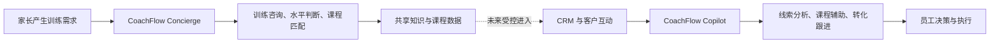
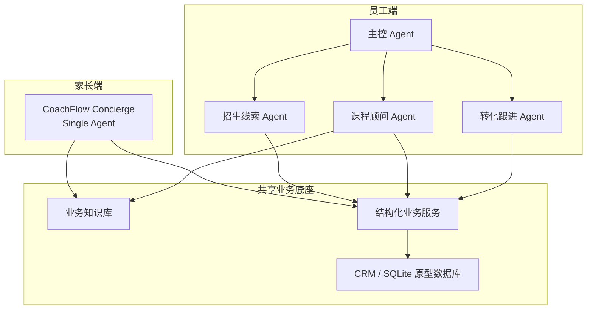

# CoachFlow AI｜少儿体育培训招生与转化 Agent

> 面向少儿体育培训机构的 AI-native 招生与转化系统。

CoachFlow 从一条真实的招生链路出发：家长咨询、课程匹配、试听、跟进与报名之间，信息往往散落在聊天记录、员工经验和 CRM 中。它将家长咨询端与机构经营端连接起来：

- **CoachFlow Concierge** 面向家长与潜在学员，提供训练咨询、水平判断与课程匹配；
- **CoachFlow Copilot** 面向老板和招生员工，连接 CRM、课程与客户互动，辅助分析线索并完成受控跟进。

> **当前状态**：这是一个基于 synthetic demo data 构建的可运行产品原型，用于验证 Agent 在少儿体育培训招生与转化场景中的价值与安全边界；并非 production-ready 产品。

<div align="center">
  &nbsp;&nbsp;&nbsp;&nbsp;
  
</div>
<p align="center"><sub>左：Staff Copilot 概念界面，数据与指标仅为视觉示例。　　右：Customer-facing concept UI，用于展示未来家长端形态；当前未接入真实微信或企业微信渠道。</sub></p>

## 一、为什么做 CoachFlow

少儿体育培训机构的招生并不是一次“推荐课程”就结束，而是一条持续经营链路：

```text
家长咨询 → 了解孩子情况 → 判断水平 → 匹配课程 → 试听 → 跟进 → 报名 / 续费
```

以少儿乒乓球培训为 Demo 场景，常见摩擦集中在四处：

1. **咨询信息散落**：年龄、基础、预算与时间偏好分散在微信、电话和到店沟通里，难以沉淀为可用信息。
2. **CRM 依赖人工维护**：员工需要反复翻聊天、录入事实、查课程，再判断下一步动作；系统存了数据，却没有降低决策成本。
3. **课程匹配依赖个人经验**：面对“9 岁、零基础、周末有空、预算有限”的家长，不同员工可能给出不一致的建议。
4. **试听后容易漏跟**：家长为什么没报名、谁应优先联系、应该怎么推进，仍主要依赖员工记忆。

CoachFlow 要验证的不是“聊天机器人会不会回答”，而是自然语言 Agent 能否在业务事实可靠、关键动作可控的前提下，减少查询、判断和录入成本，进入真实的招生工作流。

## 二、产品面向谁：B2B2C 的角色分工

CoachFlow 的核心付费方是培训机构，而家长端是机构获得咨询与转化机会的入口。

| 角色 | 典型对象 | 在 CoachFlow 中的关系 |
| --- | --- | --- |
| **Buyer** | 球馆老板、培训机构负责人 | 为招生效率与经营结果购买系统 |
| **User** | 店长、招生顾问、课程顾问 | 日常使用 CoachFlow Copilot |
| **Customer** | 家长、潜在学员 | 通过 CoachFlow Concierge 咨询训练和课程 |

因此，CoachFlow 是一个 **B2B2C SaaS 产品假设**：机构购买系统；员工用 Copilot 提高运营与转化效率；家长通过 Concierge 获得更顺畅的咨询体验，而不是被单独收费。

## 三、双端 Agent 产品设计

两个 Agent 共享知识和业务数据，但不共享同一套权限与交互方式。

| 维度 | CoachFlow Concierge | CoachFlow Copilot |
| --- | --- | --- |
| 服务对象 | 家长、潜在客户 | 老板、店长、招生与课程顾问 |
| 核心目标 | 帮孩子找到合适的训练方向和课程 | 帮员工判断该关注谁、下一步做什么 |
| Agent 形态 | Single Agent | Multi-Agent |
| 主要动作 | 咨询、判断、查询、推荐 | 查询、分析、写入、受控跟进 |
| 可访问数据 | 对家长安全的训练与课程信息 | CRM 内部业务数据 |
| 风险策略 | 严格限制能力范围 | 写操作校验，高风险动作经 HITL 确认 |

> 两端复用同一套业务底座，但由用户角色决定 Agent 能看见什么、能执行什么。

## 四、核心业务闭环



例如，家长说“孩子 9 岁、零基础、周末有时间、预算 2000 左右”，Concierge 可以理解需求并匹配课程。未来接入真实渠道后，经过身份与同意流程，这些咨询事实才会受控进入 CRM；员工随后可询问“今天哪些客户值得优先跟”，由 Copilot 结合 CRM 事实给出建议并支持后续动作。

## 五、核心产品能力

### 家长端：CoachFlow Concierge

当前原型聚焦低风险、面向家长的咨询任务：

- 训练启蒙与常见问题咨询；
- 根据年龄、学习经历与时间偏好辅助判断大致水平；
- 查询当前课程的价格、时间、教练与剩余名额；
- 基于已知条件匹配合适班型。

当前不把它包装成已上线能力：真实微信／企业微信接入、自动报名、在线支付、试听预约与完整身份体系仍未实现。

### 员工端：CoachFlow Copilot

员工可以用自然语言完成与招生业务直接相关的工作：

- 查询客户历史、试听反馈与关键互动；
- 分析线索优先级和未报名的主要阻塞；
- 结合课程条件提供匹配建议；
- 记录有效客户互动、创建明确的新客户档案；
- 在人工确认后创建跟进任务。

产品价值不在“多一次 AI 对话”，而在于把查询、判断、录入和下一步建议收敛到同一条业务链路中。

## 六、为什么员工端使用 Multi-Agent，客户端使用 Single Agent

**Agent 架构应跟随任务复杂度，而不是追逐 Multi-Agent 形式。**

Staff Copilot 同时涉及 CRM、课程、试听、客户互动、线索分析和跟进；任务类型、数据权限与操作风险都不同。因此由主控 Agent 协调招生线索、课程顾问与转化跟进三个专项 Agent。

家长端的主链路更窄：咨询 → 水平判断 → 课程匹配 → 信息确认。使用 Single Agent 可以减少路由错误、上下文交接与等待时间，让对话行为更易预测。

Multi-Agent 是处理复杂业务编排的手段，不是产品卖点本身。

## 七、基于用户角色的能力边界

| 产品能力 | 家长端 Concierge | 员工端 Copilot |
| --- | ---: | ---: |
| 训练知识咨询 | ✅ | ✅ |
| 当前课程信息查询 | ✅ | ✅ |
| 个性化课程推荐 | ✅ | ✅ |
| 查看 CRM 客户信息 | ❌ | ✅ |
| 分析线索优先级 | ❌ | ✅ |
| 查看客户历史互动 | ❌ | ✅ |
| 写入客户互动记录 | 当前不开放 | ✅ |
| 创建客户跟进任务 | ❌ | ✅，高风险动作需人工确认 |
| 查看其他客户信息 | ❌ | 受业务权限约束 |

家长端不能访问其他客户信息、内部销售标签、客户优先级或员工跟进策略。相同的底层知识和业务数据可以复用，但 Persona 决定能力边界。

## 八、AI 与业务系统如何分工

| 环节 | AI 负责 | 确定性系统负责 |
| --- | --- | --- |
| 理解用户表达 | 识别自然语言意图，提取课程需求 | 校验年龄、水平、时间等业务字段 |
| 课程建议 | 组织推荐理由与澄清问题 | 返回当前真实课程与可用条件 |
| CRM 查询 | 理解员工的问题 | 查询结构化客户与互动记录 |
| 线索分析 | 提炼客户信号与解释原因 | 用确定性业务规则完成评分 |
| 写入业务数据 | 判断用户是否明确表达了写入意图 | 去重、过滤低信息内容并执行写入 |
| 高风险动作 | 提出下一步建议 | HITL 确认后才执行 |

核心原则是：**LLM 负责理解与提出建议；确定性软件负责业务事实与执行；人负责确认高风险动作。**

## 九、为什么动态事实不能只交给 RAG

RAG 适合相对稳定的知识：水平判断、训练原则、试听 FAQ 等。当前价格、剩余名额、教练、CRM 客户历史则会随业务变化，必须从结构化业务数据中读取。

| 信息类型 | 变化速度 | 可信来源 |
| --- | --- | --- |
| 训练原则、水平判断、FAQ | 相对稳定 | 知识库 / RAG |
| 课程价格、时间、剩余名额、教练 | 动态变化 | 结构化业务数据 |
| 客户互动与试听事实 | 动态变化 | CRM |
| 线索优先级 | 由业务规则决定 | 确定性评分逻辑 |

这条边界避免模型把记忆或检索结果误当作实时业务事实。

## 十、关键产品迭代与评测方法

开发不是只写 Prompt，而是通过 Golden Case、执行轨迹与最终回答持续定位失败点并做最小修复。

| 发现的问题 | 产品判断 | 最小修复 |
| --- | --- | --- |
| 新客户被路由到转化任务 | 客户身份确认应优先于后续业务意图 | 调整路由优先级 |
| 记录互动后继续推荐课程 | Agent 不应默认替用户扩展任务 | 增加完成最小动作后的停止规则 |
| 同一事实轻微改写后重复写入 | 数据质量不能只依赖 LLM | 增加确定性的近重复保护 |
| 年龄格式导致调用失败 | Schema 本身也是产品接口 | 收紧参数类型与校验 |
| 用户要求“不要确认”仍要创建跟进 | 高风险规则不能只放在 Prompt | 将 HITL 下沉到执行流程 |
| 最终回答正确但执行路径错误 | Agent 正确性不等于文案正确 | 结合 trace 与最终回答评估 |

评测时不仅看回答是否自然，还会检查：是否正确路由、是否使用了正确能力、参数是否合理、是否读取真实业务事实、是否发生不该发生的写入，以及 HITL 是否被触发。

## 十一、当前验证状态与明确边界

### 已验证：Staff Copilot

在 Coze Preview / Debug 环境中，基于 synthetic demo data 已人工完成以下核心 E2E 验证：指定课程动态查询、CRM 客户分析、已有客户互动写回、新客户建档、新客户加首次咨询写回，以及 HITL 跟进的确认／取消分支。

### 早期原型：Customer Concierge

Customer Concierge 已作为独立 Single Agent 创建，并接入乒乓球知识库与两个只读课程能力。当前仓库展示其产品概念与接入边界，不将 Staff 侧验证外推为家长端的生产效果或自动化通过率。

### 当前尚未实现

- 真实微信／企业微信等客户渠道接入；
- 客户身份识别、同意流程与受控 Lead Capture；
- 试听预约、在线支付和自动报名；
- 生产部署、租户隔离、RBAC、监控与 PostgreSQL 生产迁移；
- 自动化 trace 回归、线上 SLA 或真实转化数据。

## 十二、商业模式与目标客户假设

CoachFlow 当前更适合作为 **B2B2C SaaS** 探索：机构为员工端效率和客户咨询入口付费，而非向家长销售 AI 对话次数。

**目标 ICP 假设**：拥有 1–5 家门店、已存在咨询和试听经营复杂度、但数字化能力仍有限的中小型体育培训机构。过小机构通常可用 Excel 与微信覆盖；大型连锁往往已有成熟 CRM 和教务系统，集成成本更高。

未来可验证的收费方向包括单店订阅、门店与席位组合、基础订阅加 AI 使用额度、多门店企业版。这些都是商业假设，不是已上线的定价方案。

## 十三、产品视角：这个项目让我验证了什么

1. **先定义 Persona，再定义 Agent。** 招生、课程、转化是业务职责；家长与员工才是不同权限、目标和体验的用户角色。
2. **不是所有任务都要 Multi-Agent。** 任务复杂度决定 Agent topology，窄链路应优先追求可预测性。
3. **Prompt 不是万能修复层。** 路由问题改路由，字段问题改契约，业务规则改后端，安全问题改工作流。
4. **动态事实不能交给模型记忆。** 价格、名额与 CRM 必须以结构化系统为准。
5. **Agent 的风险包括“多做一步”。** 因此采用最小必要动作、写入校验与 HITL。
6. **评测必须看 trace。** 最终答案正确，不等于路由、读取、写入和权限行为正确。

## 十四、下一步产品规划

1. 接入真实客户渠道，并通过身份与同意流程建立受控咨询入口；
2. 建立“家长咨询 → CRM 互动 → Staff Copilot 跟进”的真实闭环；
3. 与体育培训机构进行需求访谈，验证咨询响应速度、线索完整度、跟进完成度、试听转化与员工操作时间等业务指标；
4. 在验证需求后推进认证、RBAC、多租户、生产数据库与监控能力。

这些是待验证的产品优先级与 Business Metrics，不代表当前已有结果。

## 十五、系统架构与技术栈



- **Agent 编排**：Coze；
- **稳定知识**：Volcano Engine Knowledge Base，服务于训练原则、水平判断与 FAQ；
- **结构化业务层**：FastAPI，服务于课程、CRM、互动、评分与跟进等动态业务事实；
- **数据层**：SQLite 用于当前 prototype；PostgreSQL 是未来生产方向，并非当前部署状态；
- **实现语言**：Python。

## 十六、更多文档

README 负责呈现产品故事；以下文档保留更深入的证据与技术细节：

- [产品案例拆解](docs/product-case-study.md)
- [系统架构与权限边界](docs/architecture.md)
- [Agent 评测方法](docs/evaluation.md)
- [Agent 迭代记录](docs/agent-iteration-story.md)
- [Demo 场景](docs/demo-scenarios.md)
