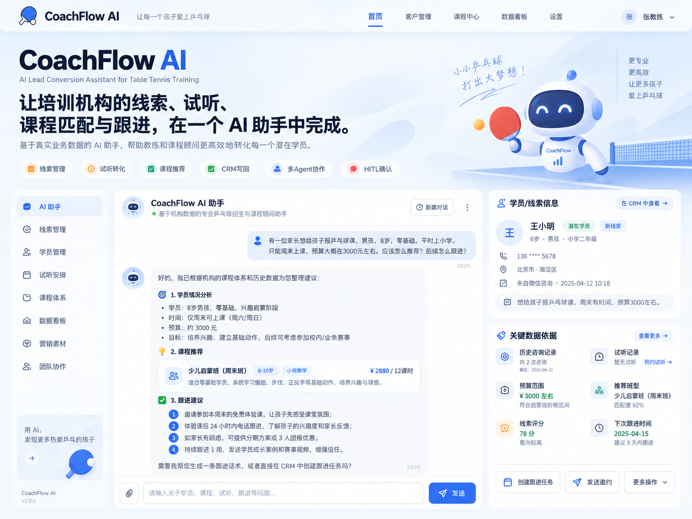
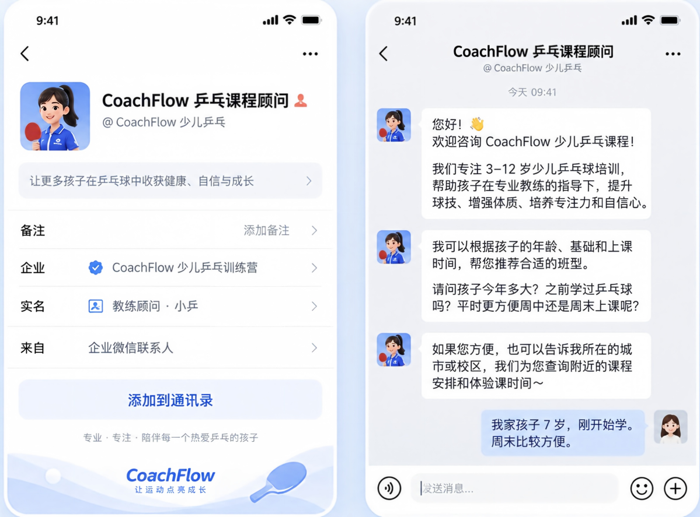
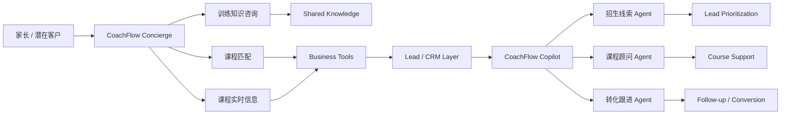

# CoachFlow AI

**AI-native lead conversion system for youth sports training businesses.**

CoachFlow 用一套共享业务数据，提供两个独立的 AI 体验：员工通过 **CoachFlow Copilot** 管理线索和转化，家长通过 **CoachFlow Concierge** 咨询训练与课程。

> **证据等级**：当前为本地原型，所有业务记录均为 synthetic demo data。Staff Copilot 的六条核心流程已在 Coze Preview / Debug 中人工验证；Customer Concierge 已在 Coze 创建独立 Single Agent 并接入知识库及两个课程查询 Tool。项目未 production 化、未接入真实客户或消息渠道，也没有自动化回归、线上指标或 SLA。

<table>
  <tr>
    <td width="50%"></td>
    <td width="50%"></td>
  </tr>
  <tr>
    <td><sub>Staff Copilot 概念界面；数据与指标仅为视觉示例。</sub></td>
    <td><sub>Customer Concierge 产品 Demo；课程与对话均为 synthetic demo data。</sub></td>
  </tr>
</table>

## One Business, Two Agent Experiences

| Experience | 用户 | 核心问题 | Agent 形态 |
| --- | --- | --- | --- |
| **CoachFlow Copilot** | 老板、店长、招生顾问、课程顾问 | 今天应该关注哪个客户，下一步做什么？ | Multi-Agent |
| **CoachFlow Concierge** | 潜在家长、潜在学员 | 我的孩子适合学什么，下一步如何开始？ | Single Agent |

### CoachFlow Copilot — Internal Staff Copilot

员工用自然语言完成 CRM 查询、Lead 分析与评分、课程推荐、客户互动写回、新 Lead 创建、转化阻塞判断和跟进任务。主控 Agent 按任务分配给招生线索、课程顾问或转化跟进 Agent；创建跟进任务必须经过人工确认。

### CoachFlow Concierge — Customer-facing AI Course Consultant

家长可以咨询乒乓球训练、判断大致水平、了解当前课程或获得课程推荐。当前 Concierge 只连接 CoachFlow 知识库、`get_course_info` 和 `recommend_courses`，不接触客户名单、销售评分或内部跟进策略。

## Shared Business Layer

两个体验共享同一套业务事实，避免维护两套课程与客户数据。



Customer Concierge 当前只使用课程知识和两个只读课程 Tool；图中的 Lead / CRM 连接表示未来受控 Lead Capture 方向，并不表示家长端现在可以直接写入或读取 CRM。

- **Knowledge Layer**：Volcano Engine Knowledge Base 用于水平判断、训练原则、FAQ 和稳定业务知识。
- **Structured Business Tools**：FastAPI 提供当前课程、价格、名额、教练及 CRM 相关能力。
- **CRM / Database**：SQLite 是原型阶段的 structured source of truth；生产方向为 PostgreSQL。

## Persona-based Capability Boundary

用户身份决定 Agent 可以看到什么、可以做什么。

| Capability / Tool | Staff Copilot | Customer Concierge |
| --- | ---: | ---: |
| Knowledge / RAG | ✅ | ✅ |
| `get_course_info` | ✅ | ✅ |
| `recommend_courses` | ✅ | ✅ |
| `list_leads` | ✅ | ❌ |
| `get_lead_detail` | ✅ | ❌ |
| `score_lead` | ✅ | ❌ |
| `record_interaction` | ✅ | 暂不直接开放 |
| `upsert_lead` | ✅ | Future controlled lead capture |
| `create_followup` | ✅ + HITL | ❌ |

Customer Concierge 不允许访问其他客户信息、Lead Score、CRM 内部销售标签、员工跟进策略或内部销售优先级。

## Why Multi-Agent for Staff, Single Agent for Customers?

架构跟随任务复杂度，而不是追求 Multi-Agent 形式。

Staff Copilot 要跨 CRM、课程、试听、互动、评分、转化和跟进协作，任务复杂且权限不同，因此由主控 Agent 分发给三个专项 Agent。Customer Concierge 当前只有“咨询 → 水平判断 → 课程匹配 → 课程信息确认”的窄任务链，Single Agent 能减少路由错误、token 成本、延迟和上下文交接，并让行为更可预测。

## Product Experience

- **员工问**：“张女士试听满意但觉得贵，还值得跟吗？”Copilot 读取 CRM 事实和确定性评分，解释阻塞因素并给出下一步建议。
- **员工说**：“张女士刚微信说预算最多 2000 元。”Copilot 识别客户、写入新事实并停止，不擅自推荐课程。
- **家长问**：“9 岁零基础，周末有什么课？”Concierge 结合稳定训练知识与当前课程数据给出匹配结果。
- **家长问**：“周末兴趣班还有几个名额？”Concierge 通过结构化 Tool 查询当前信息，不从知识库猜测。

## Validation and Boundaries

Staff Copilot 已用 synthetic demo data 人工验证：指定课程查询、客户分析、已有客户写回、新 Lead 创建、新 Lead 加首次咨询，以及 HITL 跟进的确认与取消分支。开发评审同时观察 Golden Case、执行 trace 和最终回答。

Customer Concierge 当前为独立 Coze Single Agent 原型，已接入知识库与两个只读课程 Tool；仓库不主张其 production 效果、真实客户转化或自动化评测结果。Customer 侧 Lead Capture、真实消息接入、认证、RBAC、租户隔离和生产监控仍属于后续工作。

## How the Product Was Iterated

| 发现的问题 | 定位结果 | 最小改动 |
| --- | --- | --- |
| 新客户被路由到转化 Agent | Intent routing 冲突 | 提高建档意图优先级 |
| 客户事实写回后继续推荐 | 缺少停止条件 | 完成最小动作后停止 |
| 轻微改写造成重复记录 | 字符串精确匹配不足 | 增加保守的近重复保护 |
| “8岁”导致 Tool 调用失败 | 自然语言与参数类型不一致 | 明确整数参数契约 |
| 用户要求“不用确认” | 安全约束放错层 | 由 workflow 强制确认 |

## V1 Scope

V1 验证双端 AI 如何共享业务数据并保持不同权限。不包含真实微信、支付、自动报名退款、完整管理后台或 production 身份系统。

## Read More

- [Product Case Study](docs/product-case-study.md)
- [Two-experience Architecture and Permissions](docs/architecture.md)
- [Evaluation Method](docs/evaluation.md)
- [Agent Iteration Story](docs/agent-iteration-story.md)
- [Demo Scenarios](docs/demo-scenarios.md)

## Run the Prototype

```powershell
python -m pip install -r backend/requirements.txt
.\.venv\Scripts\python.exe backend\seed.py
.\.venv\Scripts\python.exe -m uvicorn backend.app:app --host 127.0.0.1 --port 8000
```

运行 `seed.py` 会重建 synthetic demo 数据。启动后访问 `http://127.0.0.1:8000/openapi.json` 查看 Tool 契约。
