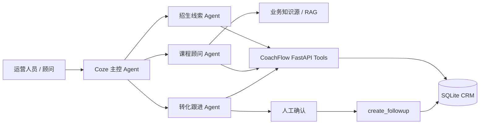
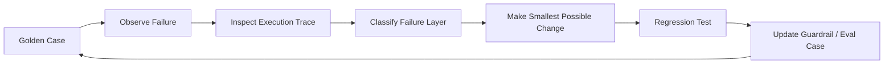

# CoachFlow AI

**AI-native CRM & Operations Copilot for youth sports training businesses.**

CoachFlow 以少儿乒乓球培训作为高保真 Demo 场景，验证员工能否通过自然语言，可靠完成招生 CRM 的查询、分析与受控写入，而不是在表格、聊天记录与后台之间切换。

> **状态：本地原型。** 所有业务记录都是虚构的 synthetic demo data，不代表真实机构、客户、营收或转化效果。

## Why CoachFlow?

少儿培训机构每天面对新家长咨询、水平不明确、班级名额变化、试听后犹豫、价格或时间冲突，以及散落在微信、电话和到店沟通中的反馈。难点不只是记录数据，而是将自然语言请求串成可追溯的业务动作：识别对象、读取事实、做受限分析，并在必要时由人确认后写入。

CoachFlow 的 V1 假设是：**自然语言可以成为 CRM 的操作入口，但动态事实、写入校验与高风险动作不能交给模型猜测。**

## 它做什么



当前仓库实现了 FastAPI + SQLite 的业务 Tool、确定性课程推荐与线索评分、课程动态信息查询，以及 CRM 的 Lead / Interaction 写入保护。`coze/multi_agent_spec.md` 记录主控与三个专项 Agent 的职责划分；六条核心流程已在 Coze Preview / Debug 中人工完成 E2E 验证，但尚未 production 化或自动化回归。

### 核心能力

1. **CRM 查询与线索分析**：读取 Lead、试听、互动与跟进记录，并由确定性规则计算 Lead Score。
2. **动态课程事实查询与推荐**：价格、时间、教练和名额来自 SQLite Tool；推荐由年龄、水平、时间、预算和容量规则生成。
3. **受控 CRM 写回**：创建明确的新 Lead、记录业务互动；写入前校验身份、低信息内容、完全重复与 10 分钟内近重复。
4. **Human-in-the-loop**：跟进任务属于写操作，当前设计要求人工确认；删除、付款、报名等高风险动作不在 V1 范围内。

## Why Agent, not another CRM dashboard?

“张女士试听满意但觉得贵，还值得跟吗？”不是单次问答：系统要定位客户、读取试听和互动事实、计算优先级、识别阻塞因素，必要时寻找替代班级，再给出下一步建议。这是多步骤任务完成，不是静态报表或 FAQ。

Agent 负责理解请求、路由和组织步骤；确定性 Tool 负责读写事实与规则计算；人负责确认高风险动作。这是 CoachFlow 的产品边界。

## Key Product Decisions

### RAG 与动态业务事实分离

Volcano Engine Knowledge Base / RAG 用于水平判断、训练原则、试听 FAQ 和稳定业务知识；当前价格、班级、名额、教练、客户互动与试听历史必须通过结构化 Tool 获取。动态事实不由 LLM 从记忆中补全。

### LLM 不直接拥有业务真相

LLM 用于理解、归纳和建议；FastAPI + SQLite 是查询、参数校验、写入和确定性业务逻辑的 source of truth。模型提出解释，软件验证事实，人确认高风险行动。

### 写操作按风险分级

`create_followup` 被设计为需确认的操作。`upsert_lead` 与 `record_interaction` 只保存调用方明确提供的事实，不推断意向、不自动改客户档案、不自动调整 Lead Score。

### CRM 写回不是静态 Seed

后端已提供 `upsert_lead` 与 `record_interaction`，并已在 Coze Preview / Debug 中人工验证新建客户、已有客户写回和新客户首次咨询写回。写入触发策略尚未 production 化，也没有自动化回归承诺。

### 控制 CRM 数据污染

互动写入会过滤低信息消息，并检查 10 分钟内的完全重复和近重复内容。`SequenceMatcher` 阈值为 0.90；已验证的样例覆盖轻微改写拦截及预算、时间、意愿变化放行。它是文本相似度保护，不能保证识别所有语义重复或事实变化。

## 当前 Tool Surface

| Tool | 用途 | 类型 |
| --- | --- | --- |
| `list_leads` | 获取线索列表 | 读取 |
| `upsert_lead` | 创建明确的新线索，避免同名家长/孩子重复 | 写入 |
| `get_lead_detail` | 查看 Lead、试听、互动、跟进历史 | 读取 |
| `record_interaction` | 写入经质量校验的客户互动事实 | 写入 |
| `recommend_courses` | 按约束推荐班级 | 读取 / 计算 |
| `get_course_info` | 查询指定课程的价格、班次、教练与名额 | 读取 |
| `score_lead` | 用确定性规则计算线索优先级 | 读取 / 计算 |
| `create_followup` | 创建待办跟进任务 | 写入，需 HITL |

## Verified Demo Flows

| Flow | Verified path | Status |
| --- | --- | --- |
| Named course query | Course Agent → `get_course_info` | ✅ Coze Preview |
| Lead analysis | CRM → `score_lead` → analysis | ✅ Coze Preview |
| Existing lead writeback | identity → `record_interaction` | ✅ Coze Preview |
| New lead creation | `upsert_lead` | ✅ Coze Preview |
| New lead + first consultation | `upsert_lead` → `record_interaction` | ✅ Coze Preview |
| HITL follow-up | confirm → `create_followup` | ✅ Coze Preview |

以上为 synthetic demo data 下在 Coze Preview / Debug 完成人工 E2E 验证的流程，不代表 production SLA 或真实客户效果。

## Evaluation 与质量门槛

仓库包含两个 Golden Case 工作簿：12 条核心用例与 36 条补充用例，覆盖路由、Tool 调用、实体识别、RAG、澄清、线索分析和 HITL 安全。开发中已在 Coze Preview / Debug 人工观察核心 E2E Flow；当前不宣称正式 Coze evaluator 分数或自动化 trace evaluation。

开发中发现仅看 final answer 的 LLM Judge 无法可靠判断 Tool 是否执行，因此人工 Debug 同时检查路由、参数、实体、grounding、HITL 和最终回答。

## How I Iterated the Agent



| 失败 | 判断层次 | 最小改动与验证 |
| --- | --- | --- |
| 新客户被交给转化 Agent | Intent routing | 调整主控优先级与节点适用场景；Preview 观察 Lead Agent → `upsert_lead` |
| 写回后继续推荐课程 | Autonomy / stop condition | 明确只提供新事实时写回即停止；以是否出现额外 Tool Call 为回归门槛 |
| 轻微改写重复入库 | Backend guardrail | 10 分钟窗口 + 0.90 文本相似度；同时检查重复拦截与新事实放行 |
| `child_age` 传成“8岁” | Tool contract | Coze 参数说明明确整数 `8`；后端保持类型校验 |
| “不用确认”与双重确认 | Workflow | 确认统一由跟进 workflow 执行；Preview 验证确认写入、取消不写入 |

这些迭代结合开发记录、Git 改动与本地规则核查，详见 [Agent Iteration Story](docs/agent-iteration-story.md)。Coze 调整属于人工 Preview / Debug 证据，本地 spec 仍是早期草稿；上图是方法示意，真实截图待补充。

- [产品案例研究](docs/product-case-study.md)
- [架构与边界](docs/architecture.md)
- [评测方法](docs/evaluation.md)
- [Demo 场景](docs/demo-scenarios.md)

## What I intentionally did NOT build

V1 不构建完整 CRM 前端、支付、真实微信接入、自动报名/退款、生产级身份系统、Redis/Kafka/Kubernetes、机器学习评分或完整多租户权限体系。优先验证的是“自然语言能否可靠完成关键 CRM 读 / 写 / 分析 / 跟进闭环”。

## Prototype → Production Evolution

当前原型：Coze Preview / Debug 人工 E2E 验证 + Volcano Engine Knowledge Base / RAG + FastAPI + SQLite + synthetic demo data。生产化需要托管数据库、认证与 RBAC、租户隔离、真实消息集成、可观测性与 tracing、CRM/教务系统集成、持久部署，以及线上评测监控。

## 技术栈

- Python、FastAPI、SQLite
- Coze Multi-Agent 与 Volcano Engine Knowledge Base / RAG
- 本地中文业务知识源
- OpenAPI Tool 契约、Mermaid 文档图

## 目录

```text
backend/   FastAPI、SQLite 访问与确定性业务逻辑
coze/      Multi-Agent 职责与 Prompt 规格
data/      本地数据库运行状态与中文知识源
docs/      产品案例、架构、评测与 Demo 说明
evals/     Golden Case 工作簿
```

## Running locally

```powershell
python -m pip install -r backend/requirements.txt
.\.venv\Scripts\python.exe backend\seed.py
.\.venv\Scripts\python.exe -m uvicorn backend.app:app --host 127.0.0.1 --port 8000
```

运行 `seed.py` 会重建本地 synthetic demo 数据。启动后可访问 `http://127.0.0.1:8000/openapi.json` 查看 Tool 契约。

## What this project demonstrates as an AI PM

- 将模糊的 Agent 想法收敛为 Lead → Course → Trial → Conversion → Follow-up 的业务工作流。
- 为 LLM、RAG、确定性 Tool 与人工确认划分职责边界，并在 Coze Debug 中人工验证关键路径。
- 用 Golden Case、Debug trace 和最终回答共同定义质量门槛；发现路由、Tool 或写入质量缺口后迭代边界与 guardrail。
- 用动态数据 grounding、Tool 参数契约与受控写入降低幻觉和脏数据风险。
- 显式记录 V1 取舍，优先验证高价值闭环而不是堆叠基础设施。
