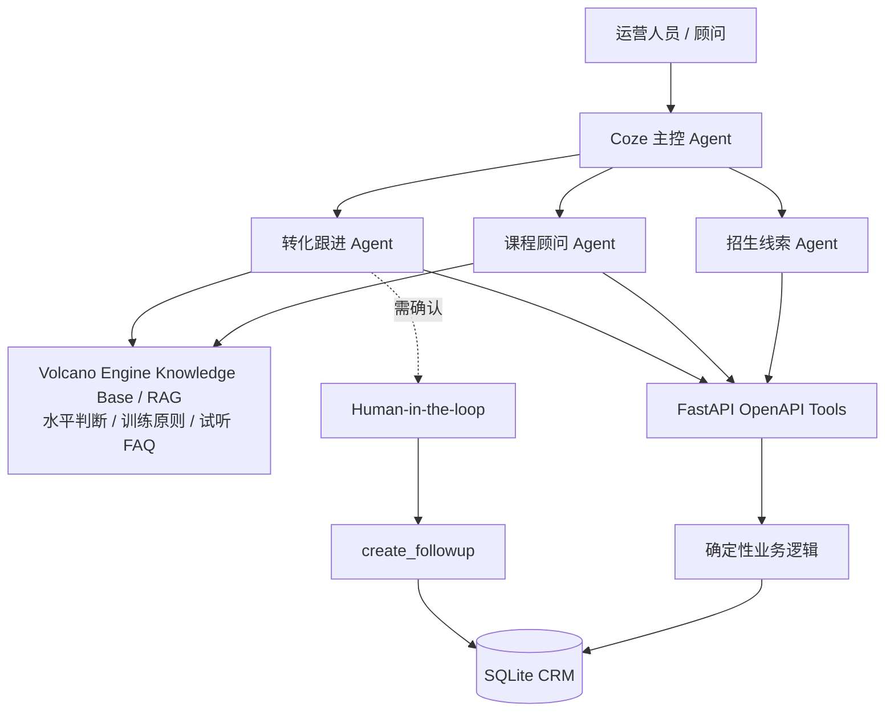

# Architecture and Product Boundaries

## System shape

## Responsibility split

| Layer | 负责什么 | 不负责什么 |
| --- | --- | --- |
| LLM / Agent | 意图理解、路由、信息归纳、建议生成 | 编造动态事实、直接改变业务真相 |
| Volcano Engine Knowledge Base / RAG | 水平判断、训练原则、试听 FAQ 和稳定业务知识 | 当前名额、价格、客户记录 |
| FastAPI Tools | 参数校验、查询、写入、规则执行 | 开放式语义判断 |
| SQLite | 当前 Demo CRM 的事实来源 | 生成自然语言建议 |
| Human-in-the-loop | 确认高风险写操作 | 代替系统查询或计算 |

## Agent responsibilities in the local Coze spec

| Agent | 核心问题 | 当前职责 |
| --- | --- | --- |
| 主控 Agent | 请求应该交给谁？ | 理解方向并路由，不直接持有业务 Tool |
| 招生线索 Agent | 这个客户是否值得关注？ | 查询 Lead、试听与互动，调用评分 |
| 课程顾问 Agent | 孩子适合什么课？ | 收集约束、调用课程推荐、使用通用知识 |
| 转化跟进 Agent | 为什么尚未报名，下一步怎么推进？ | 分析事实、评分、必要时找替代班级 |

本地 Coze 文件记录职责与 Prompt 规格；六条核心流程已在 Coze Preview / Debug 中以 synthetic demo data 人工完成 E2E 验证。它不是 production deployment：自动化回归、线上监控、认证与真实消息集成仍未完成。

## Verified E2E paths

| Flow | Coze Preview / Debug manual verification |
| --- | --- |
| 指定课程查询 | Course Agent 调用 `get_course_info` 返回动态课程信息 |
| CRM 客户分析 | CRM 查询、`score_lead` 与成交阻塞分析 |
| 已有客户写回 | 身份识别后调用 `record_interaction`，再读取确认 |
| 新客户建档 | `upsert_lead` 后通过 CRM 查询确认 |
| 新客户首次咨询 | `upsert_lead` → `record_interaction`，再读取确认 |
| HITL 跟进 | 确认后 `create_followup` 写入；取消不写入 |

## Tool risk model

| 级别 | 操作 | 当前处理 |
| --- | --- | --- |
| L0 | 读取课程、Lead、试听、互动、评分 | 可由业务 Agent 自动调用 |
| L1 | 解释、建议、跟进文案草稿 | 可自动生成，不写系统 |
| L2 | 创建 follow-up、写 CRM 事实 | 后端验证；follow-up 设计为需确认 |
| L3 | 报名、支付、退款、删除 | V1 不开放 |

## Dynamic CRM writeback

### `upsert_lead`

创建信息充分的新 Lead。后端按家长名与孩子名做精确匹配；命中已有 Lead 时不覆盖旧字段；身份不够明确或创建必填信息不足时拒绝写入。

### `record_interaction`

只记录明确发生的沟通事实。后端处理首尾/连续空白、低信息消息、10 分钟内完全重复和近重复。它不解释客户意图，不改 Profile，不改 Score，也不生成后续任务。

## Production evolution

从原型走向生产需要：托管数据库与迁移、production deployment、认证/RBAC、租户隔离、自动化 trace evaluation、审计日志、生产级身份解析、生产监控，以及与真实 CRM、教务和消息系统的集成。这些不是当前已实现能力。
