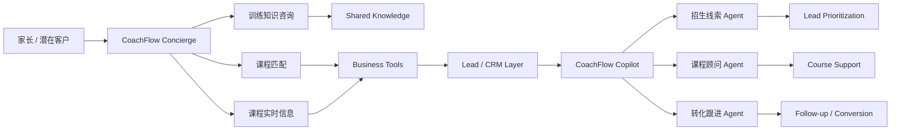

# CoachFlow AI — Two Agent Experiences Architecture

CoachFlow 采用 **Shared Business Layer + Two Agent Experiences**。员工端与家长端共享知识、课程和业务数据，但使用不同 Persona、Agent 架构与权限边界。

## End-to-end Product Loop



Customer Concierge 当前对 Business Tools 的访问仅包含课程查询与推荐。图中的 Customer → Lead / CRM 表示未来受控 Lead Capture 方向，不表示 Customer Agent 当前可直接写 CRM。

## Experience A — CoachFlow Copilot

**Persona**：机构老板、店长、招生顾问、课程顾问。

**核心问题**：今天我应该关注哪个客户，以及下一步应该做什么？

```text
CoachFlow 主控 Agent
├─ 招生线索 Agent
├─ 课程顾问 Agent
└─ 转化跟进 Agent
```

| Agent | 主要职责 |
| --- | --- |
| 主控 Agent | 理解员工意图并路由，不直接处理业务事实 |
| 招生线索 Agent | CRM 查询、新 Lead 创建、互动读取与 Lead 优先级 |
| 课程顾问 Agent | 课程推荐、指定课程动态信息与教练支持 |
| 转化跟进 Agent | 转化阻塞分析、互动写回、后续建议与 HITL 跟进 |

Staff Copilot 的任务跨越 CRM、Lead、课程、试听、互动、评分、转化和跟进。任务目标与风险不同，因此 Multi-Agent 用于拆分职责和控制 Tool 范围。

## Experience B — CoachFlow Concierge

**Persona**：潜在家长、潜在学员；已有学员家长属于未来扩展。

**核心问题**：我的孩子适合学什么，以及下一步应该怎么开始？

Concierge 是独立的 Coze **Single Agent**，当前接入：

- CoachFlow 乒乓球知识库；
- `get_course_info`；
- `recommend_courses`。

当前能力包括一般训练咨询、大致水平判断、课程选择、当前课程信息查询和课程推荐。它不承担内部 CRM 分析、销售优先级或员工跟进决策。

## Architecture Decision: Task Complexity First

Multi-Agent 不是默认产品卖点。架构由任务空间决定。

| 维度 | Staff Copilot | Customer Concierge |
| --- | --- | --- |
| 任务空间 | CRM、课程、试听、互动、评分、转化、跟进 | 咨询、水平判断、课程匹配、课程确认 |
| 权限跨度 | 内部数据读写与 HITL | 公开知识和只读课程信息 |
| 架构 | 主控 + 3 个专项 Agent | 1 个 Single Agent |
| 选择原因 | 分离职责、数据与操作风险 | 降低路由错误、token 成本、延迟和 context handoff |

**Architecture follows task complexity, not hype.**

## Shared Business Layer

| Layer | Shared responsibility | Boundary |
| --- | --- | --- |
| Volcano Engine Knowledge Base | 水平判断、训练原则、FAQ、稳定业务知识 | 不回答当前价格、名额或 CRM 事实 |
| FastAPI Structured Tools | 当前课程、价格、名额、教练、CRM、Lead、Interaction、Lead Score、Follow-up | 每个 Persona 只获得允许的 Tool |
| SQLite prototype | 当前 structured source of truth | 仅为本地原型；production 方向为 PostgreSQL |
| Human-in-the-loop | 确认 Staff Copilot 的跟进写操作 | Customer Concierge 不创建内部跟进 |

## Persona-based Capability Boundary

| Capability / Tool | Staff Copilot | Customer Concierge |
| --- | ---: | ---: |
| Knowledge / RAG | ✅ | ✅ |
| `get_course_info` | ✅ | ✅ |
| `recommend_courses` | ✅ | ✅ |
| `list_leads` | ✅ | ❌ |
| `get_lead_detail` | ✅ | ❌ |
| `score_lead` | ✅ | ❌ |
| `record_interaction` | ✅ | 暂不直接开放 |
| `upsert_lead` | ✅ | Future controlled lead capture |
| `create_followup` | ✅ + HITL | ❌ |

Customer Concierge 不允许访问其他客户信息、Lead Score、CRM 内部销售标签、员工跟进策略或内部销售优先级。这一边界由 Persona 决定，不以“两个 Agent 共用一个后端”为由扩大权限。

## Action Risk

| 级别 | 操作 | 当前处理 |
| --- | --- | --- |
| L0 | 知识、课程、Lead、试听、互动与评分读取 | 在 Persona 权限范围内自动执行 |
| L1 | 解释、课程建议、跟进文案草稿 | 可生成，不改变系统 |
| L2 | CRM 事实写入、创建 follow-up | Staff 专属；follow-up 需 HITL |
| L3 | 报名、支付、退款、删除 | V1 不开放 |

HITL 的确认 / 取消由 Coze 跟进 workflow 控制。当前 `create_followup` 后端没有确认凭证校验；已验证的防绕过行为仅限该 workflow 路径，不代表直接访问 API 也受同等保护。

## Current Evidence Boundary

Staff Copilot 的六条核心路径已在 Coze Preview / Debug 使用 synthetic demo data 人工验证。Customer Concierge 已创建为独立 Single Agent，并接入知识库、`get_course_info` 与 `recommend_courses`；当前不主张其 production 效果或自动化评测结果。

本地 Coze 文件记录的是早期 Staff Multi-Agent 草稿，未同步线上配置的全部后续调整。Production 仍需 PostgreSQL、认证 / RBAC、租户隔离、真实消息集成、服务端授权、审计、自动化 trace evaluation 和生产监控。
